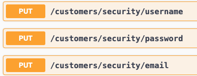

# Back End E-Commerce Car Shop

## The Back Seat Programmers:
- [Haining (Harry) Zhen]( https://github.com/hainingzhen )
- [Peace Akib]( https://github.com/pe-a-ce )  
- [Katya Grenier](https://github.com/katyagr ) 
- [Edward Todd]( https://github.com/edward1432 ) 

## Our Project Description

### What our application does

Our application manages the database for products and stock held by an online car dealership. 
The front-end UI can view and manage the database, which includes tables for registered customers, purchases and cars stocked by the dealer. 


## Customers

Customers are able to create an account, which stores their personal information and log in with their username and password. 
With this, they can purchase cars, review their purchase history and see how much credit is in their wallet. 
Customers are also able to delete their accounts or update any of their personal information if needed. 


## Purchases

In purchases, we are able to view purchases made by the customers, either by the customer or purchase ID. 
Cars can be added to a customer's basket before purchasing and when a customer purchases all the items in their basket, 
it will update their inventory and also update the stock quantity. 
Customers can keep track of when they made their purchases and how much they paid. 
If a customer tries to purchase an item that they either do not have sufficient funds for or there is not enough stock, they will be notified.

## Products
	
Product controller contains two distinct methods for searching for available products. 
The first, getProducts(), allows the front end to filter the database of cars by any combination of five properties. 
The second, searchAllProducts(), acts as a search engine for the table, allowing the user to search for a specific manufacturer and model within one search field. 
The method will then call another method in the ProductService class which splits up the string and searches the database for each specific word.

## Stock

Stock objects have a one-to-one mapping with Product objects. 
This allows the retailer to track the quantity of each product they sell while keeping this information more removed from the actual attributes of the product such as its manufacturer or price. 
Stock objects are automatically instantiated with creation of new products but can be deleted if the retailer no longer wants to sell the product. 
This allows for the product itself to remain in the database so records of previous purchases are not deleted. 
New stock objects can only be created for products which do not currently have a stock object.
 
## Technologies we used

In order to create this project, we used Java with the SpringBoot framework. We used JPA repositories with PSQL to manage our databases. 

## Challenges we faced throughout the project

- Implementing the search functionality
- Working out how to implement a delete function without messing up other tables


## Potential implementations for the future
- Add user authentication to ensure that only the customer with the correct username and password can access their account
- When a user is logged in, they are restricted to the functions they can access (i.e a customer should not need to be able to update any of the products in the store)
- Create a  Basket table that is separate from the Purchase table


## Project Setup

1. Clone the files and ensure you are working with Java version 18. 

2. Create a database in Postgres called 'group_backend'.

```
CREATE DATABASE group_backend;
```

or

```
createdb group_backend;
```
3. Run the Spring Boot application

# Endpoints

### The following endpoints uses JSON as input. 
### Other endpoints utilises request parameters or path variables. 
### Please see [Swagger-UI](http://localhost:8080/swagger-ui/index.html#/customer-controller/postCustomer) for more information.

---
---
### **IMPORTANT**: Customer and purchase endpoints require customer information in order to function properly, there are two ways to retrieve cusutomer information from the database.

### 1. Adding a new customer

E-mail and username fields must be unique. 

#### Endpoint
```
localhost:8080/customers/add_new
```

#### Input
```
{
  "name": "name",
  "username": "username",
  "email": "email",
  "password": "password",
  "address": "address"
}
```

#### Response

**201** - Successfully created a new user

```
{
  "id": 101,
  "name": "name",
  "username": "username",
  "email": "email",
  "password": "*******",
  "wallet": 0,
  "address": "******** *******",
  "mobile": null,
  "deleted": false,
  "purchases": null
}
```

**409** - Email or username is not unique

```
ERROR: duplicate key value violates unique constraint "uk_dwk6cx0afu8bs9o4t536v1j5v"
  Detail: Key (email)=(string) already exists.
```

#### If successful, you now have a customer's information to access other endpoint's functionality.

### 2. Retrieving existing customer information

#### Endpoint
```
localhost:8080/customers/login
```

#### Inputs
```
{
  "email": "string",
  "password": "string"
}
```

#### Example Response

**200** - Successfully found the customer and returned the customer's information
```
{
  "id": 101,
  "name": "string",
  "username": "string",
  "email": "string",
  "password": "******",
  "wallet": 0,
  "address": "***** ******",
  "mobile": null,
  "deleted": false,
  "purchases": []
}
```

**404** - Customer not found, either the email or password is wrong

```
No response body
```


---
---


### **IMPORTANT**: The following endpoints require customer information as inputs

## X. Changing customer security information




### Change customer's username
#### Endpoint
```
localhost:8080/customers/security/username
```
#### Input
Customer's email is required to change the username.
```
{
  "email": "",
  "username": ""
}
```
#### Response

#### Change customer's password
```
localhost:8080/customers/security/password
```
#### Change customer's email
```
localhost:8080/customers/security/email
```

## X. Changing customer information


## X. Add more credit to customer's account


---
---


